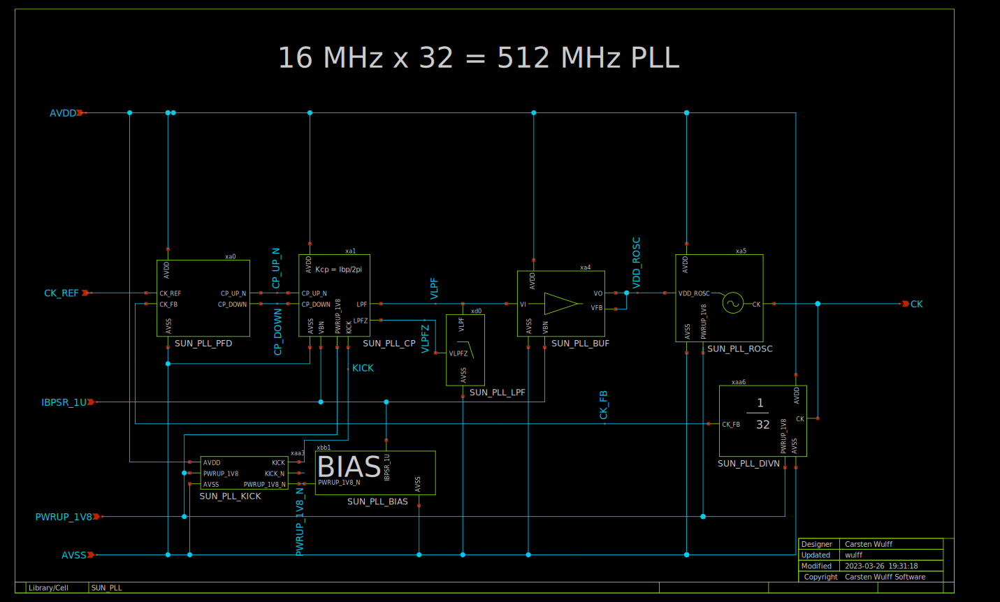
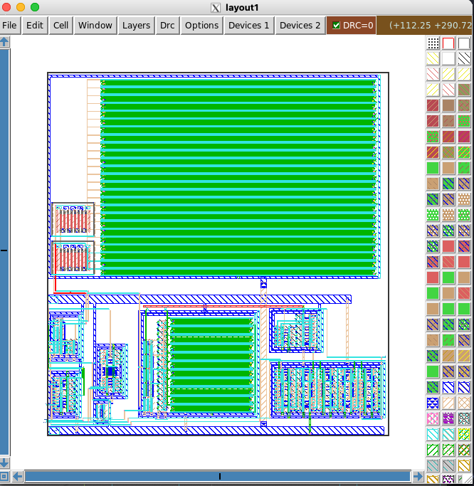

[](../../actions/workflows/gds.yaml)
[](../../actions/workflows/drc.yaml)
[](../../actions/workflows/lvs.yaml)
[](../../actions/workflows/docs.yaml)

# Who
Carsten Wulff

# Why
 Example PLL with a VDD controlled ring oscillator. This is not a design you
 should use for a real circuit. It's a design made to further develop
 ciccreator.
 
 If you wanted to use the architecture I would start by replacing the
 ring-oscillator with something different, something with smaller Kvco, for
 example a current controlled ring-oscillator.

# How
 I need a test circuit to improve cic. The files the layout is compiled with 
 
 ```bash
 cd work
 make spi ip 
 ```
 
 I've not figured out yet how to hook up the PLL top level with cic/cicpy, so 
 that's hand drawn in this version 
 
# Known issues
 
 - The ring oscillator should really be replaced by something better with lower KVCO
 - Does not work in Slow corner. Probably the loopfilter OTA cannot deliver
   enough current.
   
# Dependencies

Check [install.md](install.md)


# What

| What            | Lib/Folder       | Cell/Name |
| :-              | :-:              | :-:       |
| Schematic       | SUN_PLL_SKY130NM | SUN_PLL |
| Layout          | SUN_PLL_SKY130NM | SUN_PLL |
| LPE             | SUN_PLL_SKY130NM | SUN_PLL |


# Testbench

Full simulation will take quite a few hours 

``` bash
cd sim/SUN_PLL
make all 
```

To run a quick simulation do 

``` bash
cd sim/SUN_PLL
make typical OPT="Debug"
```


# Changelog/Plan
| Version | Status | Comment|
| :-| :-| :-|
|0.1.0 | :white_check_mark: | LVS clean |


# Signal interface
| Signal   | Direction | Domain  | Description                               |
|:---------|:---------:|:-------:|:------------------------------------------|
| AVDD     | Input     | VDD_1V8 | Main supply                               |
| AVSS     | Input     | Ground  |                                           |
| PWRUP_CV | Input     | VDD_1V8 | Power up the circuit                      |
| CK_REF   | Input     | VDD_1V8 | Reference frequenc (8 MHZ)                |
| IBPSR_1U | Input     | VDD_1V8 | 1 uA stable with temperature bias current |
| CK       | Output    | VDD_1V8 | 512 MHz output clock                      |


# Key parameters
| Parameter   | Min | Typ             | Max | Unit  |
|:------------|:---:|:---------------:|:---:|:-----:|
| Technology  |     | Skywater 130 nm |     |       |
| AVDD        | 1.7 | 1.8             | 1.9 | V     |
| Temperature | -40 | 27              | 125 | C     |
| IVDD        |     | 312             |     | uA    |
| Width       |     | 210             |     | um    |
| Height      |     | 220             |     | um    |
| Area        |     | 46              |     | kum^2 |


# Status

| Stage                       | TYPE | Status             | Comment               |
|:----------------------------|:----:|:------------------:|:---------------------:|
| Specification               | DOC  | :white_check_mark: |                       |
| Schematic                   | VIEW | :white_check_mark: |                       |
| Layout                      | VIEW | :white_check_mark: |                       |
| Layout parasitic extraction | VIEW | :white_check_mark: |                       |
| LPE simulation              | VER  | :white_check_mark: | Does not work in Slow |
| LVS                         | VER  | :white_check_mark:                |                       |
| DRC                         | VER  | :white_check_mark:                |                       |


# Schematic

For details, see [documents/schematic.md](documents/schematic.md)



# Layout


